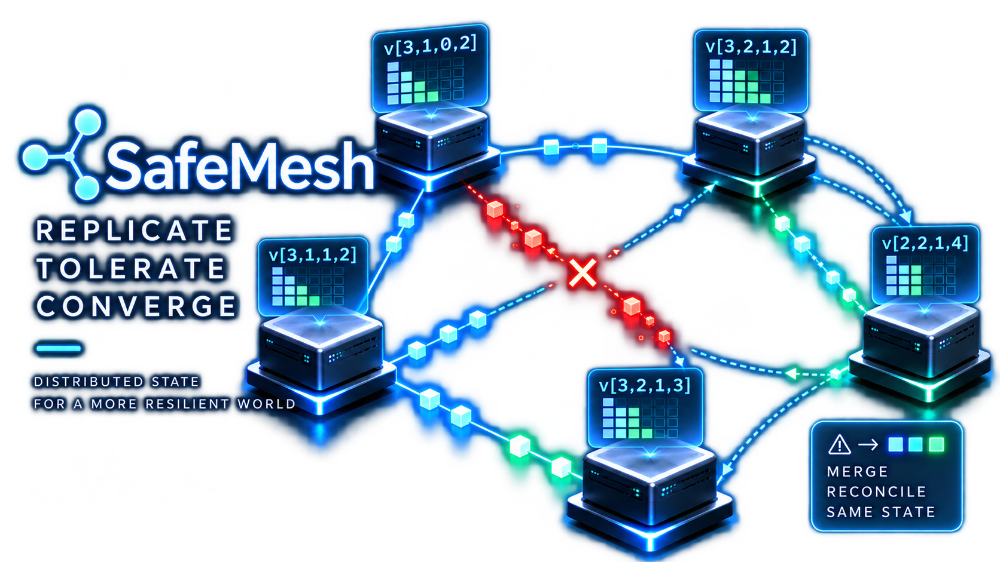

<p align="center"></p>

# SafeMesh

[](https://github.com/velvetmonkey/safemesh/actions/workflows/ci.yml)

Lean-backed CRDT convergence for small, embeddable state sync.

Read the [SafeMesh documentation](https://velvetmonkey.github.io/safemesh/) for guides and API reference.

<p align="center"></p>

API present: SafeMesh v0.1 exposes one Rust core through Rust, C ABI, WASM/TypeScript, and Python interfaces. The verified claim is intentionally narrow: G-Set, G-Counter, PN-Counter, OR-Set, and RGA/Text are backed by Lean proofs and by Rust differential tests against a Lean-generated oracle corpus. `EventLog`, wire encoding, bindings, demos, LWW Register, Enable-wins Flag, and LWW Map are outside the separate Lean proof claim. The Status and Bindings sections below name their test evidence separately from API and artifact availability.

You bring the transport and application schema. SafeMesh gives you flat CRDT carriers, append/merge/since event-log plumbing, canonical bytes, and packaging smoke tests that keep the proof bridge visible in CI.

Honest claim map: `CLAIMS.md`, `WHAT-IS-PROVEN.md`, and `ARCHITECTURE.md`.

## Persist, restore, partition and reconcile (Rust and TypeScript/Node)

Start with the [short Rust walkthrough](rust/crates/safemesh-crdt/README.md#persist-restore-partition-and-reconcile).
It runs the small [`m2slice` application](rust/crates/safemesh-crdt/examples/m2slice.rs)
with a counter and a UTF-8 OR-Set: write logs, restore replicas, make independent
updates during a simulated partition, then exchange records and explain the result.
This walk uses Rust. Python, WASM and the C FFI expose OR-Set too, as `OrSet`,
`SafeMeshOrSet` and the `safemesh_orset_*` functions.
The same four steps in TypeScript/Node, against the `wasm-pack` nodejs package, are in
[`rust/crates/safemesh-wasm/PERSIST.md`](rust/crates/safemesh-wasm/PERSIST.md).
Python also exchanges replica and event-log bytes and runs an in-memory partition-and-heal
[data-mule demo](demos/python-cold-chain/README.md), but has no documented disk or
process restore walk. The C ABI exposes the types and a G-Counter delta-to-wire helper,
with no replica or event-log surface.

## Install matrix

Artifact available: the install flows below produce local Rust packages, WASM/TypeScript packages, and Python wheels. Registry artifact availability is not established by these local flows. Maintainer-supported status is unknown for Rust, C ABI, WASM/TypeScript, and Python. These commands are dry-run or local wheel/package flows; this branch does not publish to any registry.

| Surface | Consumer command after registry publish | v0.1 dry-run/local command |
|---|---|---|
| Rust core | `cargo add safemesh-crdt@0.1.0` | `cd rust && cargo publish --dry-run -p safemesh-crdt --allow-dirty` |
| WASM / TypeScript | `npm install safemesh-wasm@0.1.0` | `tmp=$(mktemp -d) && wasm-pack build rust/crates/safemesh-wasm --target bundler --out-dir "$tmp/pkg" --release && npm pack --dry-run "$tmp/pkg"` |
| Python | `pip install safemesh-python==0.1.0` | `tmp=$(mktemp -d) && (cd rust/crates/safemesh-python && maturin build --release --features extension-module --out "$tmp/wheels") && python3 -m venv "$tmp/venv" && "$tmp/venv/bin/pip" install --no-index --find-links "$tmp/wheels" safemesh-python` |

## Run the break-it demos

Polished walkthroughs and captured assets live in [`demos/README.md`](demos/README.md).

For the browser-based SafeMesh Lab, follow the [web README's run instructions](web/README.md#run).

Runtime tested: the Rust, Node/WASM, and installed Python demo programs below check in-process modeled convergence, exit nonzero on a failed convergence check, and print `CONVERGED=true` on success. Integration tested evidence for these demos covers local package execution in the Linux CI job, not real network or hardware delivery.

| Surface | One-liner from the repo root |
|---|---|
| Rust | `cd rust && cargo run -p safemesh-crdt --example break_it` |
| WASM / Node | `tmp=$(mktemp -d) && wasm-pack build rust/crates/safemesh-wasm --target nodejs --out-dir "$tmp/pkg" --release && node rust/crates/safemesh-wasm/examples/node-convergence.mjs "$tmp/pkg"` |
| Python | `tmp=$(mktemp -d) && (cd rust/crates/safemesh-python && maturin build --release --features extension-module --out "$tmp/wheels") && python3 -m venv "$tmp/venv" && "$tmp/venv/bin/pip" install --no-index --find-links "$tmp/wheels" safemesh-python && "$tmp/venv/bin/python" rust/crates/safemesh-python/examples/data_mule_demo.py` |

## Status

**The delta-CRDT ladder is proven and the first Rust products ship against it.**

| Piece | Status |
|---|---|
| Lean delta suite (`lean/`): SEC-for-deltas + delta G-Counter, PN-Counter, OR-Set, RGA | **Proven** — zero `sorry`, axioms ⊆ {propext, Classical.choice, Quot.sound}, machine-gated (`Test/Axioms.lean`, a `lake build` default target) |
| Rust `safemesh-crdt` (`rust/`): G-Set, delta G-Counter, delta PN-Counter, delta OR-Set, RGA/Text, `no_std + alloc` (builds for `thumbv7em-none-eabihf`) | **Differentially tested** against the Lean oracle over corpus C (`tests/corpus.json`, emitted by the proven definitions via `lake exe corpus`) |
| LWW Register | **Tested, not proven** — flat max-register over `(timestamp, replica, value)`, covered by laws and wire tests but not by the Lean oracle corpus |
| Enable-wins Flag | **Tested, not proven** — flat observed-token boolean flag, covered by laws and wire tests but not by the Lean oracle corpus |
| LWW Map | **Tested, not proven** — flat per-key max-register plus remove tombstones, covered by laws and wire tests but not by the Lean oracle corpus |
| Rust EventLog API | **Engineered** — append/merge/since/version record log with deterministic dedup; useful infrastructure, not the Lean-proven CRDT theorem itself |
| Canonical wire format | **Engineered + tested** — fixed tags, little-endian integers, length-prefixed records, and sorted set encodings; round-trip, malformed-input, and byte-stability tests cover the current Rust surface |
| C ABI spine (`safemesh-ffi`) | **API present** — thin C ABI wrapper over the Rust core with committed `include/safemesh.h`. **Runtime tested** — Rust-side calls exercise the wrapper. **Build checked** — the header drift check compares generated and committed declarations. **Artifact available** — external C distribution evidence is not recorded here. **Integration tested** — an external C caller is not exercised by those Rust tests. |
| WASM / TypeScript binding (`safemesh-wasm`) | **API present** — wasm-bindgen wrapper over the Rust core with G-Counter replica/event-log exchange and committed TypeScript declarations. **Build checked** — CI compiles `wasm32-unknown-unknown` on Linux. **Runtime tested** — Rust-side binding tests exercise host behavior. **Integration tested** — the package smoke flow runs a generated package in Node; the web README separately records the Chromium walkthrough. Browser/version/OS matrix coverage is not established by the wasm32 build. |
| Python binding (`safemesh-python`) | **API present** — PyO3/maturin wrapper over the Rust core with G-Counter replica/event-log exchange and pyproject metadata. **Runtime tested** — Rust-side binding tests exercise wrapper calls. **Integration tested** — CI configures a local wheel install smoke test on `ubuntu-latest` with Python 3.11. Wheel installation across other Python/OS combinations is not established by that CI job. |
| Break-it demo (`cargo run -p safemesh-crdt --example break_it`) | **Runnable showpiece** — deterministic partition/drop/duplicate/reorder/heal scenario that exits nonzero unless the replicas converge |
| Transport coverage contract | **Engineered + tested** — `TransportAdapter`, `InMemoryTransport`, and `anti_entropy` exercise subscribe/send/connectivity under drop, duplicate, reorder, partition, and heal campaigns |
| Cold-chain kill-test (`cargo run -p safemesh-crdt --example cold_chain_kill_test`) | **Engineered evaluation** — software-only field-science vertical using the flat CRDT carriers and event-log exchange under transport faults |
| Laws harness (`--features laws`) | **Reusable tests** — checks merge laws and drop/dup/reorder convergence scenarios for any type implementing the SafeMesh traits; supplemental to the Lean-oracle diff |
| User-defined types | **Tested, not proven** — users can implement the same merge contract and run the laws harness, but SafeMesh does not prove arbitrary application code |

One proof, two bodies: the Lean development IS the semantics; the Rust crate is a second body of the same object, held to the first by differential conformance rather than by trust.

## Architecture

The verified core lives in the public, MIT-licensed [crdt-lean](https://github.com/velvetmonkey/crdt-lean): machine-checked state-based CvRDT convergence (SEC, conditional liveness, G-Set / G-Counter / PN-Counter / OR-Set / Sequence), zero `sorry`, standard axioms only. SafeMesh depends on that core and does not modify it.

SafeMesh adds:

- `lean/` — the delta-state (δ-CRDT) suite, PROVEN: deltas are carrier elements of a join-semilattice, so delta dissemination is order- and duplicate-insensitive with no causal-delivery assumption (`SafeMesh.delta_dissemination_sec`), and a delta replica is exactly a full-state replica over smaller payloads (`SafeMesh.delta_matches_state`). Concrete rungs, each reduced to what was shipped on the wire: G-Counter (`deltaGCounter_correct`), PN-Counter (`deltaPNCounter_correct_P/_N`), OR-Set add-wins membership (`deltaORSet_lookup`), RGA ordered read (`deltaRGA_read_mem` + inherited `read_sorted` / sequence-level SEC).
- `rust/crates/safemesh-crdt` — API present: `no_std + alloc` G-Set, delta G-Counter, delta PN-Counter, delta OR-Set, and RGA/Text state. Build checked: CI cross-compiles the core for `thumbv7em-none-eabihf` on Linux. Runtime tested: `tests/conformance.rs` replays inputs and expected outputs from the Lean definitions (`lake exe corpus`) byte-for-byte through the host Rust implementation, including permutations and redeliveries. Hardware runtime evidence is not provided by that cross-build.

**TCB (honest).** The theorems are kernel-checked and universal. The Rust crate is checked against them over a **finite corpus** — evidence, not a universal theorem. The trusted bridge is: Lean's compiler evaluating the proven definitions (`lake exe corpus`, kept OFF the proof path and out of the axiom gate) → the JSON corpus → serde parsing in the std test harness. A disagreement anywhere in that loop fails the build; agreement is conformance evidence over C, no more, no less.

See `ARCHITECTURE.md`, `CLAIMS.md`, and `WHAT-IS-PROVEN.md`.

## CI Gate

For the product-level Rust check, run:

```sh
cd rust
cargo test -p safemesh-crdt --features laws
```

This Lean-free check runs the CRDT tests and laws harness. For the full-repository check, run `./scripts/ci.sh` with the Lean toolchain (`lake`), Rust/rustup, cbindgen, maturin, and the web Node/npm toolchain. Build checked: the script includes Lean, Rust formatting, embedded and WASM cross-builds, the FFI header check, and the web production build. Runtime tested: it runs host Rust tests/features/examples, the break-it and cold-chain demos, and the Node-hosted web tests. Integration tested: its package smoke flow runs the installed Python wheel and the generated WASM package in Node on the CI Linux runner. Hardware and browser runtime coverage is not established by these cross-builds or Node-hosted tests.

Run `./scripts/package-smoke.sh` to verify packaging basics: `safemesh-crdt` passes `cargo publish --dry-run`, the Python wheel builds through maturin, the installed wheel exchanges canonical record/log bytes and runs the data-mule demo, and the WASM binding builds into an npm-packable wasm-pack package with a Node convergence demo.

## Laws harness

Enable `--features laws` to use `safemesh_crdt::laws`. The harness checks merge commutativity, associativity, idempotence, identity, deterministic shuffle convergence, redelivery, and split/drop-then-merge recovery over supplied sample states and deltas. This is the CI bar for custom types; it does not make custom code proven.

## Wire format and C ABI

The core crate exposes `WireEncode` / `WireDecode` for the current u64-oriented wire surface and for `Record` / `EventLog` framing. The format is deliberately boring: one-byte tags, little-endian integer fields, u32 length prefixes, and BTree-backed sorted encodings for set-like state.

The FFI spine lives in `rust/crates/safemesh-ffi`. It exposes opaque G-Counter handles and a delta-to-wire helper through `include/safemesh.h`. The header is committed and checked by tests; `cbindgen.toml` is present for regeneration when `cbindgen` is installed.

## Bindings

The first bindings are thin wrappers over the same Rust core:

- `rust/crates/safemesh-wasm` exposes `SafeMeshGCounter`, `SafeMeshGCounterReplica`, `SafeMeshLwwRegister`, `SafeMeshLwwRegisterReplica`, `SafeMeshEnableWinsFlag`, `SafeMeshEnableWinsFlagReplica`, `SafeMeshLwwMap`, `SafeMeshLwwMapReplica`, `SafeMeshOrSet`, `SafeMeshStringOrSetReplica`, `SafeMeshStringOrSetAddEntry`, `SafeMeshStringOrSetRecord`, canonical record/log bytes, and merge-from-bytes through wasm-bindgen, with a committed TypeScript declaration file.
- `rust/crates/safemesh-python` exposes G-Counter, LWW Register, Enable-wins Flag, LWW Map, and their replica/event-log surfaces through PyO3, with `pyproject.toml` configured for maturin.

Neither binding reimplements merge logic. Runtime tested: Rust-side tests for both bindings exchange canonical record/log bytes and check convergence through the shared Rust core. Integration tested: the package smoke flow exercises an installed Python wheel and a generated WASM package in Node on Linux. Maintainer-supported status for both bindings is unknown. The G-Counter binding rides the Lean-backed surface; LWW Register, Enable-wins Flag, and LWW Map remain tested-not-proven.

## Break-it demo

Narrated walkthrough: [`demos/rust-break-it/README.md`](demos/rust-break-it/README.md).

Run:

```sh
cd rust
cargo run -p safemesh-crdt --example break_it
```

The demo partitions four replicas, drops cross-partition packets, delivers same-partition packets in reverse order, duplicates a packet, then heals with anti-entropy. It prints `CONVERGED=true ...` and exits nonzero if convergence fails.

## Integrity Vertical Kill-Test

Python story walkthrough: [`demos/python-cold-chain/README.md`](demos/python-cold-chain/README.md).

`KILL-TEST.md` records the first software-only integrity vertical: field-science cold-chain sample custody. Run `cargo run -p safemesh-crdt --example cold_chain_kill_test` to exercise `EventLog`, `InMemoryTransport`, and the flat CRDT carriers through drop, duplicate, reorder, partition, and heal. This is an engineered evaluation artifact, not proof of sensors, custody law, storage durability, or real network delivery.

## Transport Coverage Contract

The core crate exposes `TransportAdapter`, `InMemoryTransport`, and `anti_entropy`. The adapter contract covers peer subscription, link connectivity, sending record batches, draining subscribed inboxes, and version-vector anti-entropy via `EventLog::since`. Versions advertise contiguous per-replica prefixes, so an out-of-order later record cannot hide earlier missing records.

The in-memory adapter is for CI fault campaigns. It can drop the next send, duplicate the next send, reverse pending delivery for a peer, partition a link, and heal it. These tests show the engineered adapter meets the coverage contract; they do not prove a real radio or network delivers packets.

## Non-goals

SafeMesh v0 is flat-first. It does not cover references between objects, trees, ordered move operations, leader election, hardware pucks, radio-delivery proofs, or a claim to be a faster Yjs. Binding glue, demos, and user-defined reducers are outside the proof-carrying surface. Binding test environments are stated separately in the Status and Bindings sections above.

`LwwRegister`, `EnableWinsFlag`, and `LwwMap` are included as tested flat types for builders who need them, but they are intentionally outside the current Lean-proven surface. Their docs and claims must stay in the tested-not-proven bucket unless Lean proofs and oracle corpora are added.

## License

Apache License 2.0 (Apache-2.0). Copyright (c) 2026 Ben Cassie. See `LICENSE` and `NOTICE`.

SafeMesh is open source and permits commercial use under Apache-2.0.
