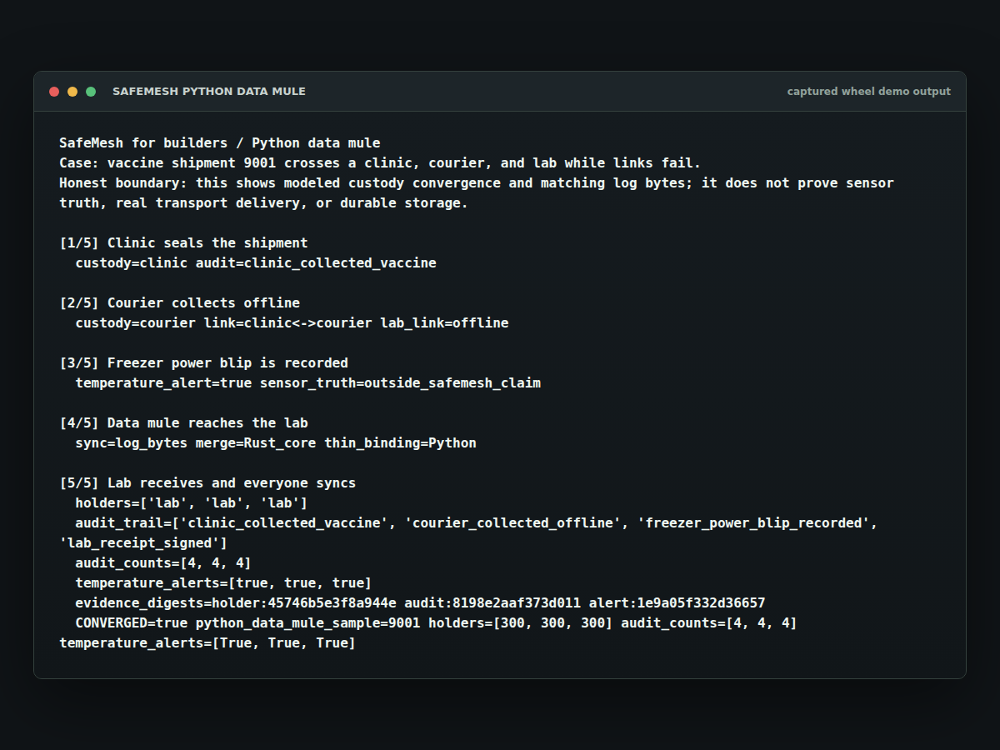

# SafeMesh for builders: Python cold-chain data mule

This is the field-science story demo: a vaccine shipment leaves a clinic, a courier collects while offline, a freezer power blip is recorded, and a lab receives the shipment after a data-mule sync. The point is not the hardware. The point is that the same Rust core can sit under a Python workflow and make the modeled custody state converge after ugly delivery.

## Historical capture

This image was added in revision
[`7795963`](https://github.com/velvetmonkey/safemesh/commit/77959639aac1ab67116a53c0d3487d2ef5e4ae2b).
Its exact capture revision and date are unknown. The image's evidence digests
are historical; the [current text transcript](#what-you-should-see) below shows
the output of the current demo.



## 30-second run

Build and install the local wheel into a temporary virtualenv:

```sh
tmp=$(mktemp -d)
(cd rust/crates/safemesh-python && maturin build --release --features extension-module --out "$tmp/wheels")
python3 -m venv "$tmp/venv"
"$tmp/venv/bin/pip" install --no-index --find-links "$tmp/wheels" safemesh-python
"$tmp/venv/bin/python" rust/crates/safemesh-python/examples/data_mule_demo.py
```

No registry publish is involved.

## What You Should See

```text
SafeMesh for builders / Python data mule
Case: vaccine shipment 9001 crosses a clinic, courier, and lab while links fail.
Honest boundary: this shows modeled custody convergence and matching log bytes; it does not prove sensor truth, real transport delivery, or durable storage.

[1/5] Clinic seals the shipment
  custody=clinic audit=clinic_collected_vaccine

[2/5] Courier collects offline
  custody=courier link=clinic<->courier lab_link=offline

[3/5] Freezer power blip is recorded
  temperature_alert=true sensor_truth=outside_safemesh_claim

[4/5] Data mule reaches the lab
  sync=log_bytes merge=Rust_core thin_binding=Python

[5/5] Lab receives and everyone syncs
  holders=['lab', 'lab', 'lab']
  audit_trail=['clinic_collected_vaccine', 'courier_collected_offline', 'freezer_power_blip_recorded', 'lab_receipt_signed']
  audit_counts=[4, 4, 4]
  temperature_alerts=[true, true, true]
  evidence_digests=holder:bb629e94dc243e37 audit:e831eab62272bb0c alert:0be44c27e43f0127
  CONVERGED=true python_data_mule_sample=9001 holders=[300, 300, 300] audit_counts=[4, 4, 4] temperature_alerts=[True, True, True]
```

The full run also prints the audit labels and short SHA-256 evidence digests for the holder, audit, and alert logs.

## What It Demonstrates

- Python calls a thin PyO3 binding; merge logic stays in the one Rust core.
- Custody starts at the clinic, moves to the courier, then settles on the lab after sync.
- A freezer excursion alert reaches every replica.
- Audit counts and log-byte digests match after the heal.
- The script exits nonzero unless all modeled replicas converge on the expected final view.

## Honest Claim Boundary

The G-Counter audit path reaches the Lean-backed Rust carrier. The LWW Map custody path, Enable-wins Flag alert path, and the Python binding glue are engineered and tested product surfaces, not separate Lean proofs in v0.1.

This demo does not prove the temperature sensor was truthful, that custody law was followed, that storage is durable, or that a real network delivered packets. It shows the modeled state and bytes converge once the logs are exchanged.

## Why This Matters

Cold-chain and field-science systems often have intermittent collectors, offline couriers, and audit needs that outlive the network conditions of the day. This demo keeps the claim narrow: the delivery path can be messy, but once the modeled logs meet, the replicas settle on the same custody view.
