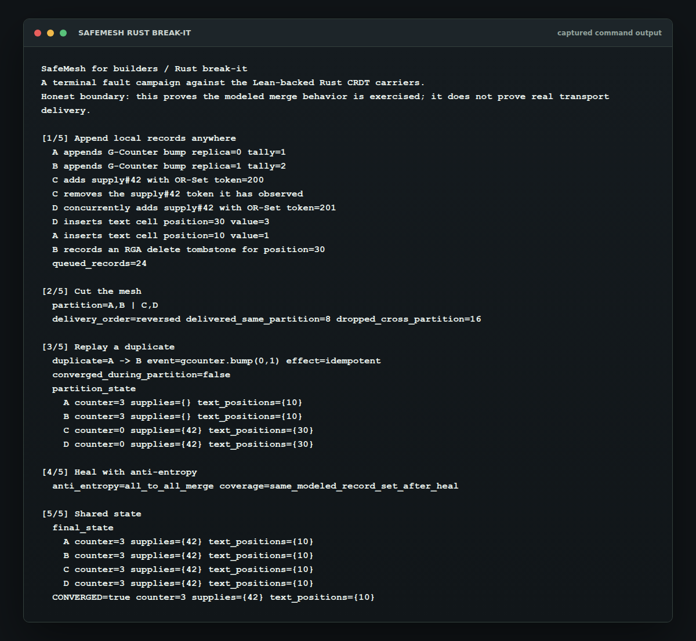

# SafeMesh for builders: Rust break-it

This is the terminal proof sketch: four Rust replicas append local CRDT deltas, split into two sides of a mesh, accept reversed delivery and a duplicate, then heal through anti-entropy until every replica shows the same state.

It is intentionally small enough to audit and dramatic enough to run in front of someone.



## 30-second run

From the repository root:

```sh
cd rust
NO_COLOR=1 cargo run -p safemesh-crdt --example break_it
```

Drop `NO_COLOR=1` for colored stage headers in a normal terminal.

## What You Should See

```text
SafeMesh for builders / Rust break-it
A terminal fault campaign against the Lean-backed Rust CRDT carriers.
Honest boundary: this proves the modeled merge behavior is exercised; it does not prove real transport delivery.

[1/5] Append local records anywhere
  A appends G-Counter bump replica=0 tally=1
  B appends G-Counter bump replica=1 tally=2
  C adds supply#42 with OR-Set token=200
  C removes the supply#42 token it has observed
  D concurrently adds supply#42 with OR-Set token=201

[2/5] Cut the mesh
  partition=A,B | C,D
  delivery_order=reversed delivered_same_partition=8 dropped_cross_partition=16

[3/5] Replay a duplicate
  duplicate=A -> B event=gcounter.bump(0,1) effect=idempotent
  converged_during_partition=false

[5/5] Shared state
  CONVERGED=true counter=3 supplies={42} text_positions={10}
```

The actual run prints the partition and final state for replicas A, B, C, and D.

## What It Demonstrates

- G-Counter, OR-Set, and RGA/Text deltas can be applied in different orders.
- Duplicate delivery has one effect because merge/application is idempotent for the modeled deltas.
- A partition can leave replicas with different local views.
- A heal step that gives replicas the same modeled record set makes the final Rust state converge.

## Honest Claim Boundary

This demo exercises the Rust body of the Lean-backed CRDT carriers. The Lean proofs cover the CRDT convergence semantics; the Rust implementation is checked against the Lean-generated oracle corpus in CI.

This demo does not prove real radio delivery, durable storage, sensor truth, or arbitrary application reducers. It uses an in-process modeled fault campaign so the merge behavior is visible and re-runnable.

## Why This Matters

SafeMesh is for builder infrastructure where the shared state layer is load-bearing. The demo is not a benchmark and not a network simulator. It is a compact witness that the same Rust core can be broken at the delivery layer and still converge once the modeled records are exchanged.
