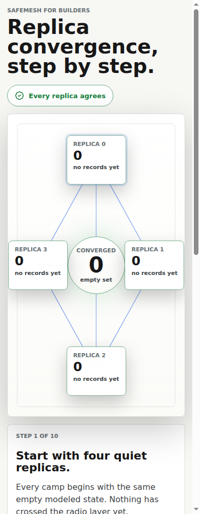

# SafeMesh for builders: interactive web convergence hero

**v0 scope:** G-Counter and OR-Set are **supported**, within the [language-path limits](https://velvetmonkey.github.io/safemesh/#v0-support).


SafeMesh's Rust crate floor for consumers is **Rust 1.89**. For the source builds,
demos and locked wasm-pack 0.15.0 installation on this page, use **Rust 1.96.1**,
the full-gate CI version. Install rustup first (Linux/Bash, with curl and a native
C compiler/linker), then select that toolchain:

```sh
curl --proto '=https' --tlsv1.2 -sSf https://sh.rustup.rs | sh -s -- -y --profile minimal --default-toolchain 1.96.1
. "$HOME/.cargo/env"
rustup default 1.96.1
```

The default applies to your user account; the repository's `rust-toolchain.toml`
also selects 1.96.1 inside this checkout. An outside application's toolchain remains
its own choice; consuming the crate requires at least 1.89.

Before the WASM builds, install their target and build tool:

```sh
rustup target add wasm32-unknown-unknown
cargo install wasm-pack --version 0.15.0 --locked
```


This is the visual demo: replicas as live nodes, deltas moving across the wire, a partition that makes state split, and a heal path that makes every modeled replica settle on the same read.




## 30-second run

First complete [Before you run](../README.md#before-you-run), including the checkout and tools for
this demo. The timing below excludes that setup and is an observation on the named machine, not a
guarantee on other machines or networks.

Runtime tested on Ubuntu 24.04.4 x86_64 (AMD EPYC-Genoa, Rust/Cargo 1.96.1, Node 22.22.3/npm 10.9.8,
wasm-pack 0.15.0, Chromium 148.0.7778.96): the commands below through the first “Choose what can go
wrong” screen took 14.44 seconds with an empty Cargo target directory, then 7.15 seconds reusing the
build. The Cargo registry, `node_modules` (installed with `NODE_ENV` unset), npm cache, and
downloaded browser were already present; each run used a fresh browser profile. Node emitted the
engine warning described in the setup guide. These times cover startup, not playing through the
scenarios.

From the repository root:

```sh
cd web
npm install
npm run dev
```

Open the local Vite URL. The first screen asks you to choose what can go wrong.

## What It Shows

- Live replica state for G-Counter and OR-Set demo data.
- Visible packet chips carrying a compact wire sketch.
- Use-case buttons for normal delivery, duplicate replay, out-of-order delivery, dropped-message recovery, and partition heal.
- A full-width replica picture with Previous / Replay / Next controls directly under it.
- Narrative and event log panels underneath the picture, explaining the chosen scenario before each step.
- A collapsed Advanced lab with controls for partition, heal, drop, duplicate, reorder, and reset.
- A technical/plain-language toggle so the honest claim boundary stays visible without making the first screen feel like docs.
- A calm-motion toggle for reduced-motion users.

## Honest Claim Boundary

The G-Counter and OR-Set use the Rust core through WASM. The TypeScript UI and transport are not the verified artifact.

The Lean-backed Rust core is the proof-carrying surface for the in-house CRDT semantics. The web demo makes the behavior inspectable and interactive; it does not prove browser code, real network delivery, storage durability, arbitrary reducers, or sensor truth.

## Why This Matters

A verified library still has to show its work. This demo makes the core idea visible without asking a builder to read the proof first: delivery gets ugly, replicas diverge for a while, and once the modeled records meet, the state settles.
