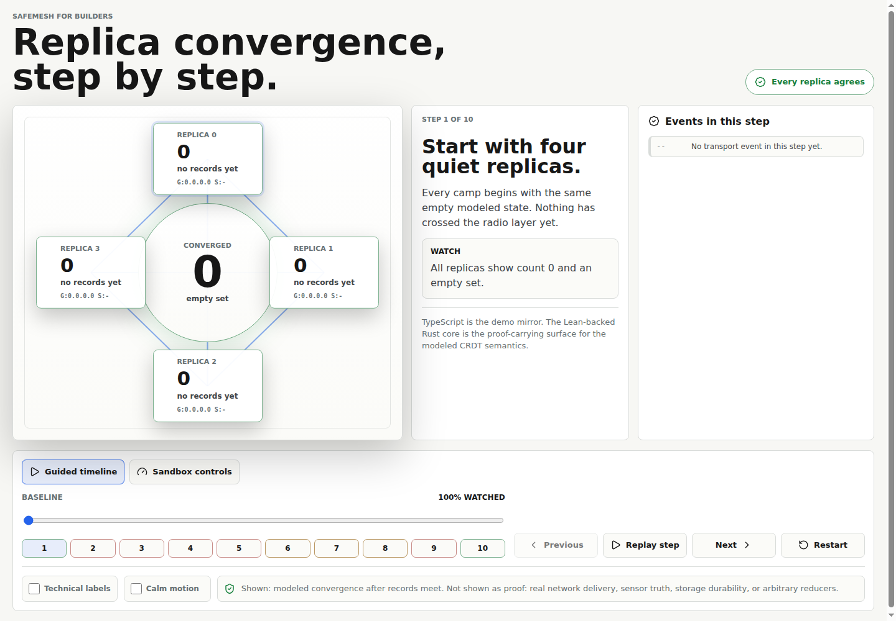

# SafeMesh web convergence hero

Interactive browser demo for the SafeMesh "watch it converge" story.



## Run

```sh
npm install
npm run dev
npm run build
npm run preview
npm run test
```

The app is static and has no backend. After a first load, the service worker caches the app shell so it can reopen offline.

## What It Demonstrates

- Simulated replicas with local CRDT state.
- A guided timeline that steps through add, duplicate, reorder, drop, partition, heal, and final inspection scenes.
- A separate sandbox mode with partition/heal, latency, drop, duplicate, and reorder controls.
- Periodic anti-entropy between connected peers so dropped one-shot messages can be recovered.
- G-Counter and OR-Set divergence under partition and convergence after reconnect.
- A live convergence indicator that compares raw states and reads.
- A technical/plain-language claim toggle and reduced-motion mode.

The guided timeline is intentionally manual: use the step markers or Previous/Next buttons to inspect one transport event at a time. The sandbox keeps the older free-form controls, but it no longer competes with the narrative path.

## Honesty Boundary

Lean is the SafeMesh semantic oracle. The TypeScript in this PWA is not proof-carrying verified code; it is a browser demo mirror.

- G-Counter: mirrors `SafeMesh.deltaBump`, `SafeMesh.deltaGCounter_correct`, `SafeMesh.delta_dissemination_sec`, and `SafeMesh.merge_deltaState`. This CRDT also has a shipped Rust body that is differentially tested over corpus C.
- PN-Counter: included only as a small TypeScript reference mirror of `SafeMesh.deltaBumpP`, `SafeMesh.deltaBumpN`, and `SafeMesh.deltaPNCounter_correct_P/_N`; the current UI does not center it.
- OR-Set: mirrors Lean-proven `SafeMesh.orAddDelta`, `SafeMesh.orRemoveDelta`, and `SafeMesh.deltaORSet_lookup` directly. Rust OR-Set ships in `safemesh-crdt` and is differentially tested over corpus C.

Do not present this PWA as the verified artifact. It is the demo skin around the proof-backed product body.

## Anti-Entropy

The simulator periodically exchanges compact state digests between connected peers and backfills missing G-Counter coordinates, OR-Set add tokens, and OR-Set tombstones. This is a transport/re-gossip behavior in the demo, not a new CRDT.

The Lean anchor for this backfill is `SafeMesh.merge_deltaState`: merging replicas is equivalent to receiving the union of their delta sets. `SafeMesh.delta_dissemination_sec` is the separate order/redelivery-insensitivity result once deltas are delivered. Neither theorem makes this TypeScript implementation verified.

## PWA Cache Note

The service worker uses a versioned cache and network-first navigation. Old caches are deleted on activation so development rebuilds are not pinned behind a stale app shell.
